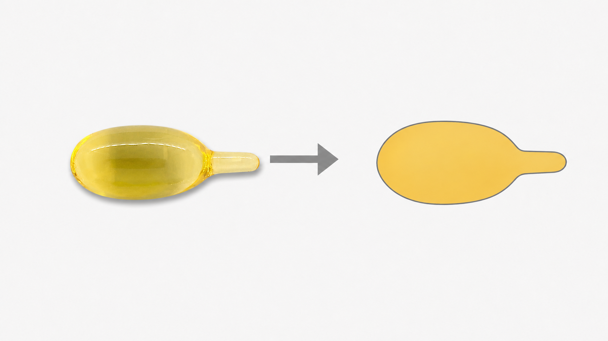
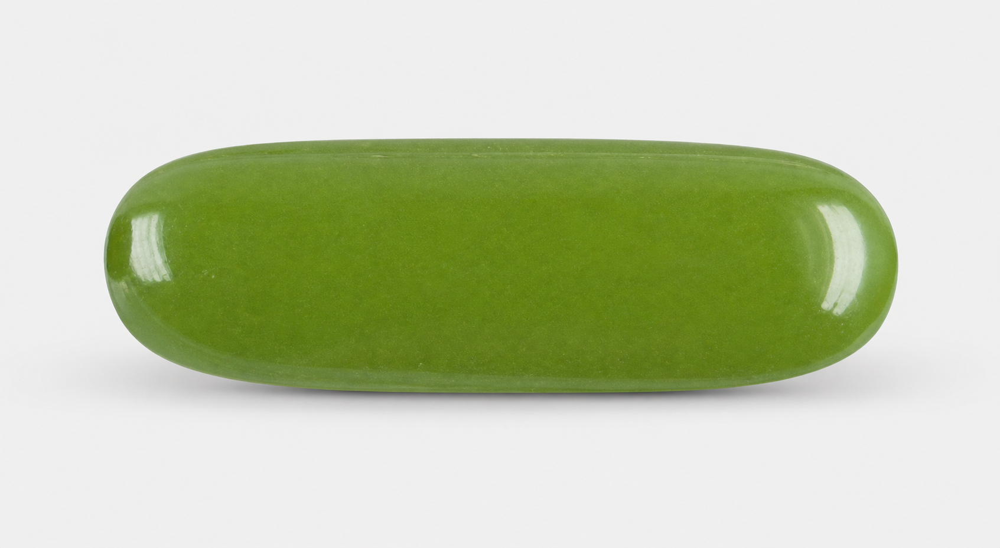
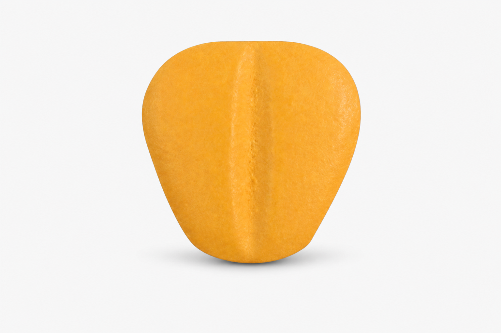
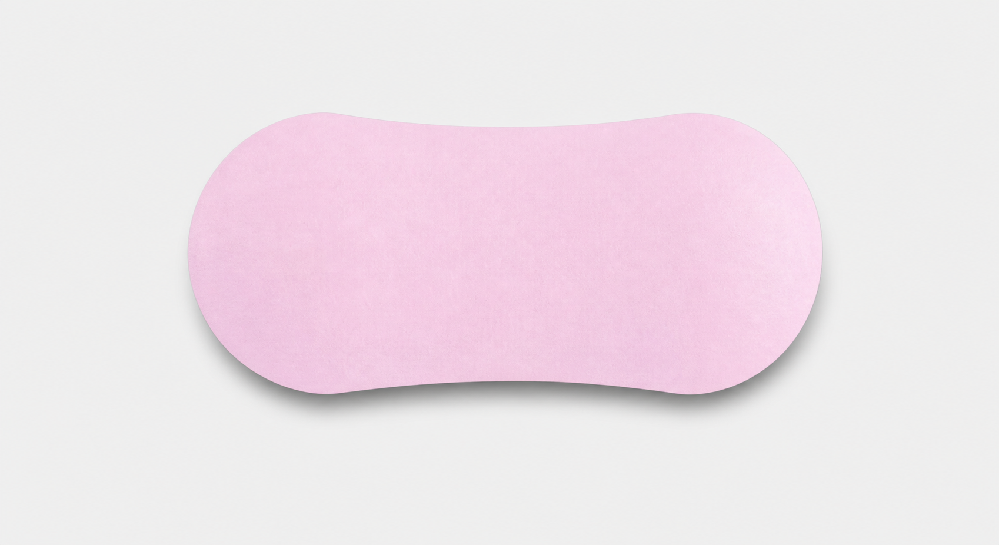

# 알약 제형 유사도 검색 발표 자료 — 3장 구성

## 사용 이미지

- 1장 형상 추출 과정: `ppt/shape_extraction_process.png`
- 3장 장방형: `ppt/shape_rectangular.png`
- 3장 사과형: `ppt/shape_apple_v2.png`
- 3장 땅콩형: `ppt/shape_peanut.png`

## 공통 디자인 가이드

- 화면 비율은 16:9로 구성하고, 충분한 여백과 정렬된 카드형 요소를 사용한다.
- 제목, 핵심 메시지, 세부 설명의 글자 크기를 단계적으로 구분해 정보의 우선순위를 분명히 한다.
- 핵심 수치는 굵은 글씨와 큰 크기로 강조하고, 본문은 한 영역당 3줄 이내로 유지한다.
- 세 장 모두 상단에는 장 제목, 바로 아래에는 한 문장 핵심 메시지를 배치해 기존 발표 자료의 중간에 자연스럽게 연결되도록 한다.

---

## 1장. 형상만으로 제형 후보를 좁히는 검색 구조

### 화면에 들어갈 내용

**핵심 메시지**  
알약의 외곽 윤곽을 수치화해 새 이미지와 형태가 가까운 제형을 찾는다.

왼쪽 — 검색 과정:

```text
[알약 이미지]
      ↓
[알약 영역 분리]
      ↓
[56차원 형상 임베딩]
      ↓
[품목별 프로토타입과 거리 비교]
      ↓
[29개 제형 중 Top-k 후보 반환]
```

오른쪽 — 형상 추출 이미지:



이미지 하단 캡션:  
**입력 이미지 → 외곽 윤곽 표현**

하단 핵심 포인트:

- 별도의 딥러닝 모델 학습 없이 윤곽 특징을 직접 계산
- 투명 이미지, 일반 JPG, 앞·뒷면이 함께 있는 이미지 처리
- 회전·반전에 따른 특징 변화를 줄여 형상 자체를 비교

### 레이아웃·디자인

- 화면 상단 20%에는 제목과 핵심 메시지를 배치한다.
- 본문은 `검색 과정 48% / 형상 추출 이미지 52%`의 2열로 구성한다.
- 왼쪽에는 5단계 세로형 파이프라인을 둥근 사각형 카드와 화살표로 연결한다.
- 오른쪽 이미지는 원본 비율을 유지한 채 큰 카드 안에 배치하고, 아래에 한 줄 캡션을 넣는다.
- `56차원`, `Top-k`, `29개 제형`은 굵고 크게 표시한다.
- 하단 핵심 포인트 3개는 화면 아래쪽에 동일한 너비의 작은 카드로 배치한다.

### 발표 스크립트

“저희가 구현한 방식은 알약의 외곽 윤곽을 수치화해 유사한 제형을 검색하는 구조입니다. 오른쪽 예시처럼 입력 이미지에서 알약 영역을 분리하고, 외곽 윤곽을 형상 정보로 변환합니다. 이 윤곽은 56차원 형상 임베딩으로 표현되며, 미리 구축한 품목별 대표 벡터와의 거리를 비교해 29개 제형 가운데 가까운 후보를 순서대로 제시합니다. 딥러닝 모델을 별도로 학습하지 않아도 적용할 수 있고, 알약이 회전되거나 뒤집힌 경우의 차이도 줄이도록 특징을 정규화했습니다. 또한 한 이미지에 앞면과 뒷면이 함께 있는 경우에도 각각의 알약을 찾아 처리할 수 있습니다.”

---

## 2장. 5만 장의 이미지를 품목·제형 대표 벡터로 압축

### 화면에 들어갈 내용

**핵심 메시지**  
기본 기하 특징과 윤곽 주파수 특징을 결합하고, 이미지 단위 정보를 품목과 제형 단위로 집계했다.

왼쪽 — 56차원 형상 임베딩 구성:

| 특징 그룹 | 차원 | 가중치 | 표현하는 정보 |
|---|---:|---:|---|
| 기본 기하 특징 | 9 | 40% | 비율, 원형도, 이심률, 볼록성, 대칭도 |
| EFD | 24 | 35% | 전체 윤곽의 굴곡과 형태 |
| 방사형 FFT | 16 | 20% | 중심에서 외곽까지의 반복 패턴 |
| Hu moment | 7 | 5% | 회전 등에 강한 전역 형상 |

오른쪽 — 인덱스 생성 과정:

```text
54,282장 이미지 특징
        ↓ 품목별 중앙값
27,345개 품목 프로토타입
        ↓ 제형별 중앙값
29개 제형 중심 프로토타입
```

하단 강조 문구:  
**제형 중심 + 품목별 대표 벡터를 함께 저장해 다양한 세부 형태를 검색에 반영**

### 레이아웃·디자인

- 화면을 55:45로 나눈다. 왼쪽에는 특징 그룹을 4개의 가로 막대 또는 도넛 차트로 표현하고, 오른쪽에는 숫자가 줄어드는 깔때기형 집계 흐름을 배치한다.
- `54,282장`, `27,345개`, `29개`는 오른쪽에서 가장 큰 글씨로 표시한다.
- 특징 그룹은 서로 다른 막대 길이와 명확한 항목명으로 구분하고, 가중치가 큰 순서대로 시각적 면적도 크게 표현한다.
- 하단 강조 문구는 전체 너비의 배너 안에 굵은 글씨로 넣는다.

### 발표 스크립트

“형상 임베딩은 네 종류의 특징을 결합한 56차원 벡터입니다. 기본 기하 특징은 가로세로비, 원형도, 이심률, 볼록성, 대칭도처럼 직관적인 모양을 표현합니다. EFD는 윤곽 전체의 굴곡을, 방사형 FFT는 중심에서 외곽까지 거리의 반복 패턴을 담고, Hu moment는 전역적인 형태를 보완합니다. 이렇게 추출한 5만 4,282장의 이미지 특징을 먼저 품목별 중앙값으로 모아 2만 7,345개의 품목 프로토타입을 만들었습니다. 이어서 이를 제형별로 다시 집계해 29개의 제형 중심을 구성했습니다. 검색할 때는 제형 중심뿐 아니라 품목별 대표 벡터도 함께 활용해, 같은 제형 안에서 나타나는 여러 세부 형태까지 반영합니다.”

---

## 3장. 실제 이미지에서 확인한 제형 검색 결과

### 화면에 들어갈 내용

**핵심 메시지**  
서로 다른 외곽 형태의 테스트 이미지에서 기록된 제형이 검색 결과 1위로 나타났다.

상단 — 추론 흐름:

```text
새 이미지 입력 → 알약 객체별 특징 추출 → 품목 프로토타입과 거리 계산 → 제형별 Top-k 순위 생성
```

중앙 — 테스트 이미지 카드:

| 장방형 | 사과형 | 땅콩형 |
|---|---|---|
|  |  |  |
| **Top-1 일치** | **Top-1 일치** | **Top-1 일치** |

하단 — 결과와 함께 제공되는 정보:

- 가장 가까운 품목 프로토타입까지의 거리
- 1위와 2위 후보 사이의 거리 차이
- 제형 중심까지의 거리와 가장 유사한 실제 품목

### 레이아웃·디자인

- 화면 상단 22%에는 제목, 핵심 메시지, 한 줄 추론 흐름을 배치한다.
- 중앙 58%에는 동일한 크기의 사진 카드 3개를 가로로 나란히 배치한다.
- 각 카드는 `사진 70% / 제형명과 Top-1 일치 30%` 비율로 구성한다.
- 사진은 원본 비율을 유지하되 카드 안에서 알약 크기가 비슷해 보이도록 맞춘다.
- 하단 20%에는 결과 정보 3개를 아이콘과 함께 한 줄로 배치한다.
- 이 장도 발표의 마지막 페이지처럼 보이지 않도록 별도의 결론 문구는 두지 않는다.

### 발표 스크립트

“새 이미지가 들어오면 검출된 알약별로 형상 특징을 계산하고, 각 품목 프로토타입까지의 거리를 구한 뒤 제형별 후보 순위를 생성합니다. 화면에는 서로 다른 외곽 형태를 가진 장방형, 사과형, 땅콩형 테스트 이미지를 배치했습니다. 현재 확인한 세 이미지에서는 CSV에 기록된 제형이 각각 검색 결과 1위로 나타났습니다. 결과에는 제형명만 제공되는 것이 아니라 가장 가까운 거리, 1위와 2위의 거리 차이, 제형 중심까지의 거리, 그리고 가장 유사한 실제 품목도 함께 표시됩니다. 따라서 29개 전체 제형을 직접 살펴보는 대신, 형태가 가까운 후보군부터 빠르게 확인할 수 있습니다.”
